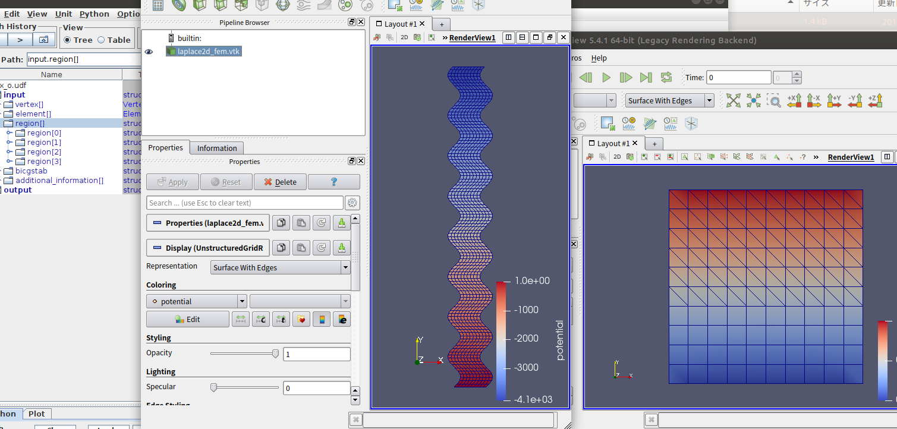

# laplace2d_fem

2次元のラプラス方程式の有限要素法のプログラムです。
三角形要素と四角形要素の混合でも解けるように作ってみました。
[OCTA](http://octa.jp/)のインターフェースであるGOURMETで動きます。
GOURMETのメニューから、 Tool>Environments Setup から、ダウンロードしたディレクトリを指定して使ってください。

実行ファイルは、Ubuntu18.04.5でコンパイルしています。 
laplace2d_fem -I inputfile -O outputfile で実行してください。
たとえば、 laplace2d_fem -I triangle.udf -O triangle_o.udf のようにです。

-------------

